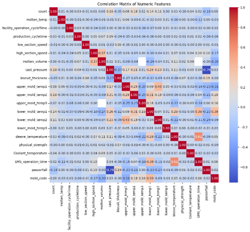
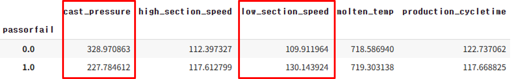
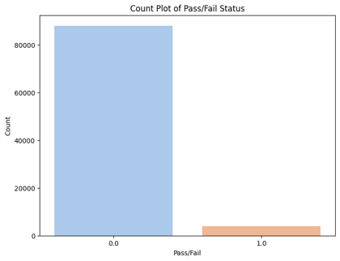
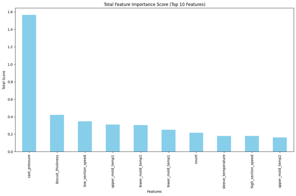
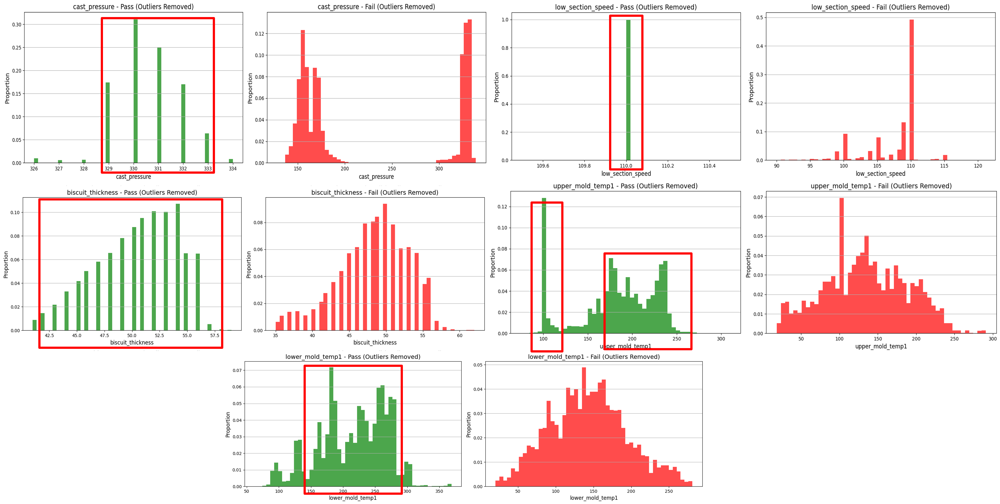

# Die Casting Process Optimization

This project focuses on optimizing the die casting manufacturing process using machine learning techniques, with an emphasis on **visual exploratory data analysis (EDA)** and **feature interpretation through data visualization**.

## 📌 Project Overview

Die casting is a manufacturing process in which molten metal is injected into a mold cavity under high pressure. While it offers high precision and cost-efficiency, inconsistencies in managing key process variables cause quality fluctuations and increase defect rates.

This project aims to:
- Visually analyze key variables such as pressure, speed, temperature, and cycle time.
- Predict product defects (pass/fail) based on process data.
- Propose optimal process control ranges to maximize production success.

**Dataset Source**: KAMP Casting Process Optimization AI Dataset  
**Size**: 92,015 rows × 31 columns  
**Target Variable**: `passorfail` (0 = Pass, 1 = Fail)

## 📊 Exploratory Data Analysis (EDA)

Extensive visual EDA was conducted to understand key factors influencing defect rates.

### Correlation Matrix
Cast pressure (`cast_pressure`) shows a strong negative correlation (-0.76) with product defects.

### Pivot Table Visualization
Significant mean differences observed for `cast_pressure` and `low_section_speed` between pass/fail groups.

### Target Distribution (Imbalance)
The pass/fail target variable is highly imbalanced. Handling imbalance was a key focus during modeling.

## ⚙️ Methodology

The modeling process was iterated in **three major trials**, with visualization-driven insights informing each step.

### 🔁 Trial 1
- Dropped columns with >40% missing values.
- Applied **SMOTE** oversampling for fail class (minority).
- Models: Random Forest, XGBoost, LightGBM.
- **F1 score (class=1)** ≈ 0.90.

### 🔁 Trial 2
- Applied **KNN Imputer (k=5)** for missing value handling.
- Models: XGBoost, Random Forest, Logistic Regression.
- **XGBoost** achieved the best performance with **F1(class=1) = 0.91**.
- Feature Importance Visualization confirmed the influence of `cast_pressure` and `mold_temp`.

### 🔁 Trial 3
- Engineered new features (interaction terms, binning).
- Applied log and quantile transformations to skewed features.
- Conducted detailed EDA by success/failure groups to derive additional transformations.

## 🏆 Final Model & Results
- **Selected Model**: XGBoost (Trial 2)
- **Final Performance**:
  - **F1 Score (fail class)**: 0.91
  - **Accuracy**: > 99%

## 🔍 Key Findings
Optimal control ranges identified to maximize success rates:

| Variable              | Optimal Range        |
|-----------------------|----------------------|
| Cast Pressure         | 329 – 333             |
| Low Section Speed     | Around 110            |
| Biscuit Thickness     | 42 – 57               |
| Upper Mold Temperature| 100, 170 – 250        |
| Lower Mold Temperature| 150 – 300             |

Key findings were supported by distribution plots showing success probabilities across variable ranges.

## ✅ Additional Notes
- Full analysis and modeling pipeline are reproducible through the `die_casting_process_optimization.ipynb` notebook.

## 👨‍💻 Team Members
- 신재원 (24510107)
- 최진아 (24510117)
- 한상훈 (24510115)

